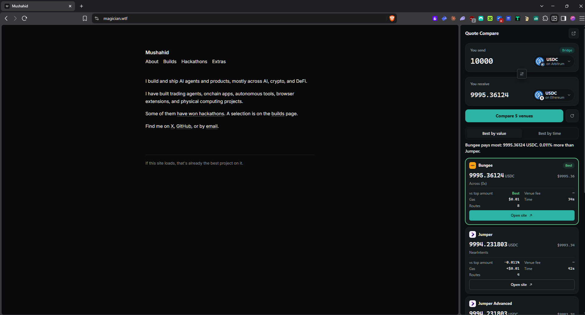
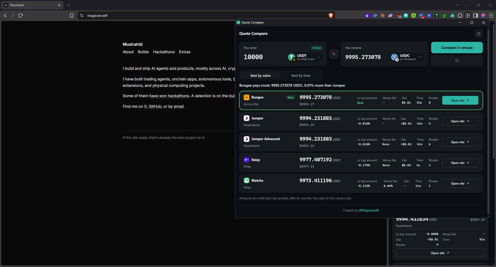

<div align="center">


# Crypto Bridge & Swap Compare

**A Chrome extension that compares crypto swap and bridge quotes across Jumper, Jumper Advanced, Bungee, Relay and Matcha, side by side, fees included.**<br />
Pick a trade, see what each site would give you after its own fee, and open the winner with the trade filled in.

<br />

<a href="../../releases/latest/download/crypto-bridge-swap-compare-chrome.zip">
  
</a>

<br /><br />

<a href="https://x.com/Magicianafk">
  
</a>

<sub>Built by <a href="https://x.com/Magicianafk">@Magicianafk</a></sub>

</div>

---

<p align="center">
  
</p>

<p align="center">
  
</p>

## Why

Aggregators only compare their own sources, and each one takes its own fee out of the number it shows you. Jumper started charging a fee on jumper.xyz while jumper.xyz/advanced does not, and the same bridge (Across, Relay, Stargate...) often pays a different amount depending on which site you use it through.

Crypto Bridge & Swap Compare asks all five sites the same question at once and shows you the answer each one gives.

## What it does

- **Five venues at once:** Jumper, Jumper Advanced, Bungee, Relay and Matcha.
- **Swaps and bridges:** same chain is a swap, different chains is a bridge. No mode to pick.
- **One best route per venue,** in two views:
  - **Best by value:** each venue's highest-paying route, venues ranked by what you receive.
  - **Best by time** (bridges only): each venue's fastest route, venues ranked by speed.
- **Fees shown:** each venue's own fee (for example Jumper's 0.02% "LIFI Fixed Fee", Matcha's 0x fee), gas, time, and how far each venue is behind the top amount.
- **A one-line verdict:** "Bungee pays most: 9995.27 USDC, 0.01% more than Jumper."
- **17 chains, 112 built-in tokens** with logos, a searchable token picker, and any token by pasted contract address.
- **Open site** takes you to that venue with the trade already filled in. You review and sign there.
- **Side panel or pop-out:** works in Chrome's side panel, or in a wide window with every venue on one screen.

## Install

1. Click **Download for Chrome** above and unzip `crypto-bridge-swap-compare-chrome.zip`.
2. Open `chrome://extensions` and turn on **Developer mode** (top right).
3. Click **Load unpacked** and select the unzipped folder.
4. Pin Crypto Bridge & Swap Compare and click its icon to open the side panel.

Works in Chrome and Chromium browsers with side panel support, such as Brave and Edge.

## How it works

Crypto Bridge & Swap Compare does not call any quote API. It opens the five sites in a minimized background window with your trade already in the URL, reads the quote each site's own page receives, and shows it to you. The numbers are the ones each site would show you, after its own fee.

- No API keys, no backend, no account.
- It never connects a wallet, approves a token or signs anything. You do that on the venue's own site.
- It only reads pages it opened itself. Your own Jumper, Bungee, Relay or Matcha tabs are left alone.
- If a venue can't quote, its card says why: the page did not load, the page never asked for a quote, or its quote was for a different trade.

## Supported chains

Ethereum, Arbitrum, Base, Optimism, Polygon, BNB Chain, Avalanche, Linea, zkSync Era, Scroll, Blast, Mantle, Gnosis, Sonic, Unichain, Berachain and Robinhood Chain.

Every built-in token address is checked on-chain (symbol and decimals) by `scripts/check-tokens.mjs`. Not every venue supports every chain; a venue that doesn't will show "Page never asked for a quote".

## Permissions

| Permission | Why |
|---|---|
| `sidePanel` | Shows the extension in Chrome's side panel. |
| `storage` | Remembers your last trade form. Nothing else is stored. |
| `jumper.xyz`, `app.bungee.exchange`, `relay.link`, `matcha.xyz` | Opens those sites in its own background tabs and reads their quotes. |

No other sites, no browsing history, no remote code, no analytics.

## Develop

Requires Node 24+ and pnpm.

```bash
pnpm install        # also generates WXT types
pnpm dev            # runs the extension in a dev browser with hot reload
pnpm verify         # typecheck, lint, unit tests
pnpm build          # production build in .output/chrome-mv3
pnpm zip            # zip for distribution in .output/
pnpm smoke          # live end-to-end check against the real sites (needs network)
```

| Path | What lives there |
|---|---|
| `src/venues/` | One adapter per site: builds its prefilled URL and reads its quote response. |
| `src/capture/` | The in-page reader for the sites' own quote requests. |
| `src/controller.ts` | Opens the venue tabs, tracks timeouts, turns responses into quotes. |
| `src/panel/`, `entrypoints/sidepanel/` | The side panel and pop-out UI. |
| `tests/fixtures/` | Real quote responses recorded from each site, used by the unit tests. |
| `scripts/` | Live smoke test, on-chain token check, logo and icon generators. |

Design notes live in `docs/` and `DESIGN.md`.

## Release

CI (`.github/workflows/ci.yml`) runs `pnpm verify` and builds the zip on every push and pull request.

To publish a release:

```bash
# bump "version" in package.json first, e.g. 0.1.1
git tag v0.1.1
git push origin v0.1.1
```

The release workflow checks the tag matches `package.json`, runs the tests, builds, and attaches `crypto-bridge-swap-compare-chrome.zip` to a GitHub Release. The Download button above always points at the latest release.

## Credits

Built by [@Magicianafk](https://x.com/Magicianafk). Venue, chain and token logos belong to their owners.
