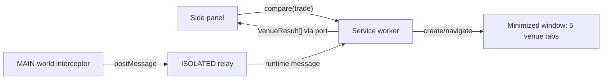

# Architecture

Full design: `docs/superpowers/specs/2026-09-29-quote-compare-extension-design.md`. Venue evidence: `docs/TEARDOWNS/venues.md`.

## System map

## Components

| Component | Path | Runtime | Owns |
|---|---|---|---|
| Side panel | `entrypoints/sidepanel/` | extension page | trade form, prefill, results table |
| Worker | `entrypoints/background.ts` | MV3 service worker | venue window, owned-tab map, timeouts, parsing |
| Interceptor | `entrypoints/interceptor.content.ts` | MAIN world on venue origins | fetch/XHR capture, visibility spoof (owned tabs only) |
| Relay | `entrypoints/relay.content.ts` | ISOLATED world on venue origins | ownership check, capture forwarding |
| Adapters | `src/venues/` | shared | URL build/parse, request match, response parse |

## Data

- Store: `chrome.storage.local` holds the last trade only. Captured bodies are never persisted.

## External services and trust boundaries

| Service | Used for | Credential location | Trust |
|---|---|---|---|
| jumper.xyz, app.bungee.exchange, relay.link, matcha.xyz | pages loaded in owned tabs; their own quote traffic is read | none | untrusted data |

## Key invariants

- The extension issues no network request of its own to any venue or quote API.
- Captures are accepted only from tabs the worker created.
- Captured text is rendered as text nodes only, never HTML.
- No wallet, signing or approval code exists in this repo.

## Verify

`pnpm verify` = `tsc --noEmit && oxlint . && vitest run`.
