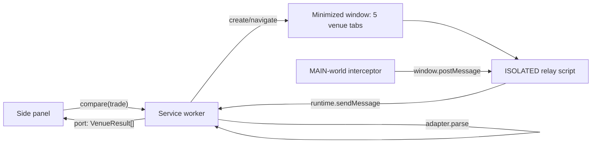

# Quote Compare extension: design

Date: 2026-09-29. Status: approved in chat, awaiting written-spec review.
Evidence for every venue detail below: `docs/TEARDOWNS/venues.md`.

## Intent

**User said:** a browser extension that compares swap and bridge rates across Jumper, Jumper Advanced, Bungee, Matcha and Relay, read from each site's own frontend, not from LI.FI or Socket APIs. Jumper now charges a fee on jumper.xyz; jumper.xyz/advanced does not.

**Assumed (confirmed by approval):** the user wants to see, for one trade, which venue and route returns the most tokens after fees, then execute on that site by hand. The extension never connects a wallet or signs.

**Success:** for a supported trade, a ranked table of every route from all five venues appears within 30 s, with amounts that match what each site shows for the same input.

## Decisions taken with the user

1. Read quotes by tapping the responses each site's page already receives (not DOM scraping, not calling APIs).
2. Entry point is a Chrome side panel with a trade form, prefilled from the active tab when it is one of the five venues.
3. Venues run in one unfocused, minimized extension-owned window with five tabs.
4. Jumper and Jumper Advanced are separate venues; aggregators (Jumper, Bungee) list the same bridge separately, so rows are per venue x route.

## Scope

In: EVM chains Ethereum (1), Arbitrum (42161), Base (8453), Optimism (10), Polygon (137), BNB (56). Swap (same chain) and bridge (cross chain), exact-input only. Built-in tokens per chain: native, WETH (WBNB/WPOL where relevant), USDC, USDT; any ERC-20 by pasted address.

Out: wallets, signing, approvals, limit/TWAP/multi-swap tabs, Solana and other non-EVM chains, auto-refresh, history, any direct call to a quote API, Chrome Web Store publishing.

## Architecture



### Units

| Unit | Path | Does | Depends on |
|---|---|---|---|
| Types | `src/types.ts` | `Trade`, `Token`, `Quote`, `VenueResult`, message types | nothing |
| Venue adapters | `src/venues/<venue>.ts` | `buildUrl(trade)`, `parseUrl(url) -> Partial<Trade>`, `matches(requestUrl)`, `parse(capture, trade) -> Quote[]` | types, `lib/sse` |
| SSE reader | `src/lib/sse.ts` | split an accumulated `text/event-stream` body into `{event, data}` records; tolerant of a partial trailing record | nothing |
| Ranking and format | `src/lib/rank.ts`, `src/lib/format.ts` | sort quotes by raw `toAmount` (bigint), compute delta vs best, format units | types |
| Token list | `src/lib/tokens.ts` | built-in tokens per chain, native address per venue convention | types |
| Interceptor | `entrypoints/interceptor.content.ts` (MAIN world, `document_start`, venue origins only) | wraps `fetch` and `XMLHttpRequest`; for URLs any adapter `matches`, clones the response, streams the body text, posts `{kind:'capture', url, method, reqBody, status, text, done}` on each chunk and at end; on a `spoof-visibility` message, pins `document.visibilityState='visible'`, `document.hidden=false`, `document.hasFocus()=true` and stops `visibilitychange` propagation | adapters' `matches` only |
| Relay | `entrypoints/relay.content.ts` (ISOLATED, `document_start`) | asks the worker "is this tab owned?" (`hello`); the reply carries the comparison's `generation`. If owned, posts `spoof-visibility` to the MAIN world, forwards captures (checked: `event.source === window`, shape-validated) tagged with that generation, and runs the Matcha amount fallback | runtime messaging |
| Worker | `entrypoints/background.ts` | owns the venue window and `tabId -> venue` map; on `compare(trade)` creates or reuses the window and navigates each tab to `adapter.buildUrl(trade)`; routes captures from owned tabs to `adapter.parse`; per-venue timeout; streams `VenueResult[]` to the side panel over a port; closes the window when the port disconnects | adapters, rank |
| Side panel | `entrypoints/sidepanel/` (vanilla TS + CSS) | trade form, prefill from active tab via each adapter's `parseUrl`, results table, open-in-venue links | types, tokens, format |

Captures from tabs the worker does not own are dropped, so the user's own browsing on those sites never enters a comparison. Captures tagged with an older generation (a page from the previous comparison still unloading) are dropped too. Each capture carries a per-page `id`; a lower id never replaces a higher one. Venue tabs are created blank and only navigated after the worker has recorded their ids, so the first `hello` always finds its tab.

### Venue specifics

| Venue | `buildUrl` | Match | Parse |
|---|---|---|---|
| Jumper | `https://jumper.xyz/?fromChain&fromToken&toChain&toToken&fromAmount`, native `0x000…0` | `api.jumper.xyz/pipeline/v1/advanced/routes/stream` and request body `options.integrator === "jumper.exchange"` | SSE `routes` events -> `data.routes[]` (LI.FI route). One `Quote` per route: `route = steps.map(s => s.toolDetails.name).join(" > ")`, `toAmount`, `toToken.decimals`, `toAmountUSD`, `gasCostUSD`, ETA = sum of `steps[].estimate.executionDuration`, venue fee = items named `LIFI Fixed Fee` or containing `integrator` (case-insensitive) in `steps[].estimate.feeCosts` (top-level step only, not `includedSteps`, to avoid the duplicate) |
| Jumper Advanced | `https://jumper.xyz/advanced?…same…` plus `tab=bridge-advanced` when cross chain | same endpoint, `integrator === "jumperadvanced"` | same parser and same fee rule as Jumper (fee items named `LIFI Fixed Fee` or containing `integrator`); on the teardown trade it finds none |
| Bungee | `https://app.bungee.exchange/?originChainId&destinationChainId&inputToken&outputToken&amount`, native `0xeee…e` | `backend.socket.tech/v3/swap/quote/stream` | last `snapshot` event with routes -> `result.routes[]`: route = bridge or DEX `protocol.displayName`, `output.amount`, `output.token.decimals`, `output.valueInUsd`, `gasFee.feeInUsd`, `estimatedTime`. Venue fee shows "—": no recorded response carries fee details (`routeDetails.feeDetails` is null), and `output.amount` is already net |
| Relay | `https://relay.link/bridge/<destSlug>?fromChainId&fromCurrency&toCurrency&amount`, native `0x000…0` | XHR `relay.link/api/relay/quote/v2` | single `Quote`: route `Relay`, `details.currencyOut.amount` + `.currency.decimals`, `details.currencyOut.amountUsd`, gas = `fees.gas.amountUsd`, venue fee = `fees.app.amountUsd`, ETA `details.timeEstimate` |
| Matcha | `https://matcha.xyz/?sellChain&sellAddress&buyChain&buyAddress&sellAmount`, native `0xeee…e` | `/api/swap/price` (same chain), `/api/cross-chain/quote` (cross chain) | swap: `buyAmount` (already net), route = fill sources joined. Cross: `result.quote.buyAmount`, route = `steps[].provider`, ETA `estimatedTimeSeconds`. Venue fee is a percent: each of `integratorFee`, `zeroExFee`, `providerAppFee` divided by the sell amount when its token is the sell token, else by the pre-fee buy amount (0.25% swap and 0.4% cross-chain on the fixtures). Decimals from the trade's `toToken`. The page ignores `sellAmount` on some first loads, so owned Matcha tabs type the amount into the first `input[placeholder="0.0"]` if it is still empty after 8 s |

Relay destination slugs and same-chain URL form are verified during the build smoke test (see Risks).

### Data model

```ts
type VenueId = 'jumper' | 'jumper-advanced' | 'bungee' | 'relay' | 'matcha';
interface Token { chainId: number; address: `0x${string}`; symbol: string; decimals: number | null }
interface Trade { fromChainId: number; toChainId: number; fromToken: Token; toToken: Token; amount: string /* human units, as typed */ }
interface Quote {
  venue: VenueId; route: string;
  toAmount: string /* raw integer */; toDecimals: number;
  toAmountUsd?: number; gasUsd?: number; venueFee?: { usd?: number; pct?: number; label: string };
  etaSec?: number; tags?: string[];
}
type VenueStatus = 'loading' | 'ok' | 'empty' | 'error' | 'timeout';
interface VenueResult { venue: VenueId; status: VenueStatus; quotes: Quote[]; error?: string; updatedAt: number }
```

Pasted tokens have `decimals: null`; the panel fills it from the first venue response that carries `toToken` decimals (Jumper, Bungee, Relay), and Matcha rows wait for it.

## Behaviour

- **Compare:** validates the form (different token or chain, amount > 0, both tokens known), sends `compare(trade)`, marks all five venues `loading`. Bridge mode sets `toChainId != fromChainId`, swap mode forces equality.
- **Streaming results:** each capture re-parses the accumulated body, so rows appear as SSE events arrive. A capture with `done` and zero quotes marks the venue `empty`. A parse exception marks it `error` with the message. No capture within 30 s marks it `timeout` (Matcha gets 40 s: it hydrates slowly).
- **Table:** one row per quote, sorted by `toAmount` descending. Columns: venue, route, you receive (token units, plus USD when known), vs best (% and token delta), venue fee, gas USD, ETA. Venue-level states (loading, empty, error, timeout) render as one muted row per venue, below the quotes.
- **Open:** a row's button focuses a normal new tab on `buildUrl(trade)` for that venue; the user signs there.
- **Prefill:** on panel open and tab switch, if the active tab URL parses with a venue adapter, the form fills from it (mapping unknown token addresses to pasted tokens).
- **Lifecycle:** the venue window is created on the first compare, reused (tabs navigated) for later ones, closed when the panel closes. "Refresh" re-navigates all tabs.

## Permissions

`sidePanel`, `storage` (last trade), `tabs` (read the active tab URL for prefill). Host permissions and content-script matches: `https://jumper.xyz/*`, `https://app.bungee.exchange/*`, `https://relay.link/*`, `https://matcha.xyz/*`. No `<all_urls>`, no `webRequest`, no `declarativeNetRequest`, no remote code.

## Trust and safety

- The extension never sends a request of its own to any venue or quote API; all traffic is the venue pages' own.
- Captured bodies are treated as untrusted: shape-checked in adapters, never rendered as HTML (text nodes only), never persisted.
- A script on a venue page could forge a capture message. Impact is a wrong number in the table; mitigations: only owned tabs are accepted, captures are shape-validated, and the user executes on the venue site where the real quote is shown.
- The visibility spoof runs only in owned tabs.

## Error handling

Adapter parse errors are caught per capture and surface as the venue's `error` state; they never stop other venues. Window creation failure surfaces as a panel banner. A tab the user closes by hand marks its venue `error: tab closed` and is recreated on the next compare.

## Testing

- Unit (Vitest): each adapter's `buildUrl`/`parseUrl` round trip, `matches`, and `parse` against recorded fixtures in `tests/fixtures/<venue>/` (captured with Claude in Chrome, addresses zeroed); `sse` with partial and multi-chunk bodies; `rank` ordering and delta; interceptor wrapper against a fake `fetch`/XHR.
- `pnpm verify` = `tsc --noEmit && oxlint . && vitest run`, under 120 s.
- Manual smoke (recorded in `tasks/todo.md`): load unpacked, run the two teardown trades (0.1 ETH Arbitrum -> Base ETH; 0.1 ETH -> USDC on Base) and check each venue's top row against the site.

## Stack

TypeScript, WXT (MV3), Vitest, oxlint, pnpm. Versions checked with `npm view` at scaffold time.

## Risks

- **Venue drift:** endpoints or shapes change. Contained to one adapter file and its fixture; the venue shows `error` instead of breaking the table.
- **Minimized window throttling:** if a venue does not quote while minimized, fall back to a small unfocused normal window (one flag in the worker).
- **Relay URL form:** destination slugs for the six chains and same-chain swaps are unverified; verified in smoke, with slugs taken from Relay's own `/api/relay/chains` response if needed.
- **Venue terms of service:** automated page loads may conflict with a site's terms; the extension only loads public pages at the user's request, one page load per venue per compare.
